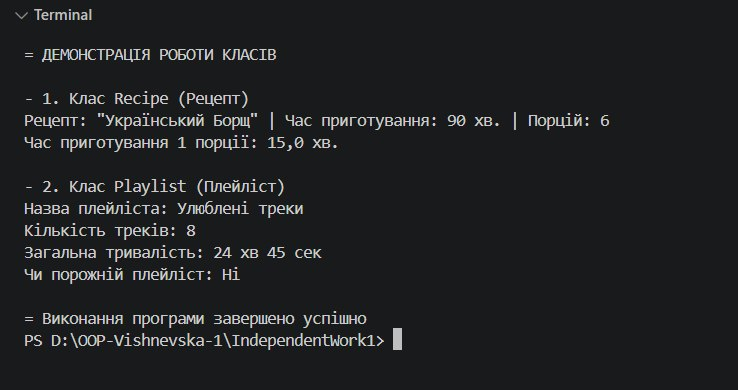

# Самостійна робота №1 

**Тема:** Базовий синтаксис C# і оголошення класів.  
**Виконила:** Вишневська Наталія  
**Група:** ІПЗ-3/1  

---

## 1. Посилання на GitHub-репозиторій
https://github.com/vishnevska/OOP-Vishnevska.git

---

## 2. Опис створених класів
У проєкті реалізовано 2 класи, що моделюють сутності реального світу:
* **`Recipe` (Рецепт)**:
  * *Приватні поля:* `_title`, `_cookingTimeMinutes`, `_servings`.
  * *Властивості:* `Title` (get/set) та read-only властивість `Servings` (get).
  * *Методи:* `GetTimePerServing()` (розрахунок часу на 1 порцію) та `PrintRecipeInfo()`.
* **`Playlist` (Музичний плейліст)**:
  * *Приватні поля:* `_name`, `_totalDurationSeconds`, `_trackCount`.
  * *Властивості:* `Name` (get/set) та read-only `TrackCount` (get).
  * *Методи:* `GetFormattedDuration()` (переведення секунд у хвилини/секунди) та `IsEmpty()`.

---

## 3. Результат виконання програми

---

## 4. Відповіді на контрольні запитання

1. **Мінімальні елементи класу у цьому завданні:**  
   Клас повинен містити приватні поля для збереження стану, публічні властивості (зокрема 
   з обмеженням доступу/read-only) для контрольованого доступу, конструктор з параметрами
    для ініціалізації об'єкта та хоча б один метод з логікою/обчисленнями.
2. **Чому поля доцільно робити приватними (`private`):**  
   Це фундаментальний принцип інкапсуляції. Приватні поля захищають внутрішні дані 
   об'єкта від некоректної прямої зміни ззовні, а властивості дозволяють додати 
   валідацію або зробити поле доступним тільки для читання (read-only).
3. **Призначення конструктора:**  
   Конструктор використовується для початкової ініціалізації полів об'єкта при його 
   створенні (через оператор `new`). Він гарантує, що об'єкт одразу перебуватиме в 
   коректному початковому стані.
4. **Демонстрація роботи методів у `Main`:**  
   Потрібно створити об'єкти класів з конкретними вхідними даними, викликати їхні методи
    та вивести отримані значення або сформований текст у консоль за допомогою
     `Console.WriteLine()`.