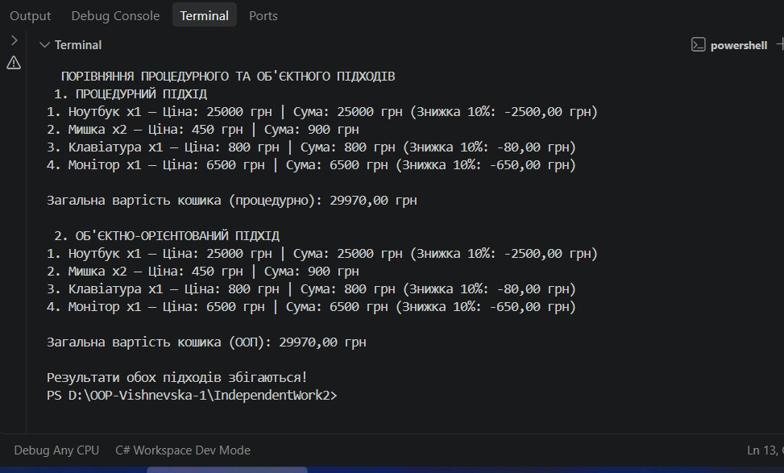

# Самостійна робота №2 

**Тема:** Процедурний і об’єктний підходи: порівняння на прикладі.  
**Виконила:** Вишневська Наталія 
**Група:** ІПЗ-3/1  

---
## 1. Проблеми процедурного підходу

Під час реалізації кошика у процедурному стилі виявлено такі конкретні недоліки:
1. **Синхронізація паралельних масивів:** Дані про один товар розкидані по трьох різних масивах (`names`, `prices`, `quantities`). Якщо випадково помилитися з індексом або видалити елемент з одного масиву, зв'язок між даними зламається.
2. **Відсутність валідації та гарантії довжини:** Немає механізму, який гарантує, що масив цін та масив кількостей мають однакову довжину. Додавання товару вимагає ручного розширення всіх масивів.
3. **Складність повторного використання:** Логіка обчислення знижки `ApplyDiscounts()` жорстко прив'язана до масивів `prices` та `itemTotals`. Її неможливо зручно використати для окремого товару чи іншого сценарію без передачі цілого набору параметрів.

---

## 2. Порівняння процедурного та об'єктно-орієнтованого підходів

| Критерій | Процедурний підхід | Об'єктно-орієнтований підхід (ООП) |
| :--- | :--- | :--- |
| **Структура даних** | Дані збережені в розрізнених паралельних масивах (`string[]`, `double[]`, `int[]`). | Дані об'єднані у цілісні сутності (`Product`, `CartItem`, `Cart`). |
| **Цілісність даних** | Відсутня гарантія того, що елемент `prices[i]` відповідає `names[i]`. | Гарантована: `Product` містить і назву, і ціну як єдиний об'єкт. |
| **Додавання нової операції** (наприклад, видалення) | Потрібно вручну зсувати елементи у всіх 3-х масивах одночасно. | Достатньо додати метод `RemoveItem()` у клас `Cart` через `List.Remove()`. |
| **Масштабованість** | Важко додати нові атрибути (наприклад, вагу чи знижку) — треба створювати ще масиви. | Легко: розширюємо клас `Product` новими властивостями без зміни логіки кошика. |

---

## 3. Результат виконання програми

---

## 4. Відповіді на контрольні запитання

1. **Конкретні незручності процедурного підходу з паралельними масивами:**  
   Найбільша незручність — ризик розсинхронізації даних, складність передачі великої кількості масивів у кожен метод як окремих параметрів та відсутність інкапсуляції.

2. **Чому логіка знижки природніше виглядає як метод класу:**  
   В ООП знижка є властивістю/поведінкою самого товару або кошика. Метод класу має прямий доступ до внутрішніх полів об'єкта (`Price`, `Quantity`), тому йому не потрібно передавати купу сторонніх масивів.

3. **Що стало легше змінити чи розширити після переходу на класи:**  
   Легко додавати нові методи (наприклад, очищення кошика, пошук товару, підрахунок кількості одиниць), розширювати властивості товару (додати артикул, категорію) та використовувати клас `Cart` у будь-якій іншій частині програми.

4. **У яких задачах процедурний підхід залишається виправданим:**  
   Процедурний підхід виправданий у дуже простих одноразових скриптах, математичних обчисленнях, лінійних алгоритмах обробки даних або утилітах без складної предметної області та великої кількості пов'язаних сутностей.