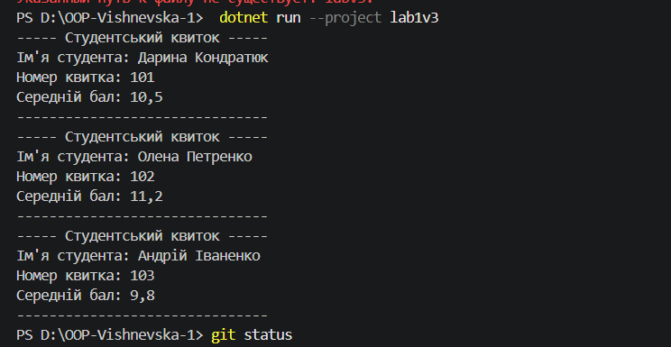

# Лабораторна робота №1 з ООП

## Створення першого проєкту. Класи, об'єкти та конструктори

### Виконала
- ПІБ: Вишневська Наталія
- Група: ІПЗ-3/1
- Варіант: 3

## Мета роботи

Ознайомитися із середовищем розробки Visual Studio Code, навчитися створювати класи та об'єкти, використовувати конструктори, властивості й методи в мові програмування C#.

## Індивідуальне завдання

Реалізувати клас Student із такими елементами:

- Поля: name, id.
- Властивість: AverageMark.
- Метод: PrintCard() — виводить інформацію про студентський квиток.

## Хід роботи

1. Створено консольний проєкт мовою програмування C#.
2. Реалізовано клас Student із приватними полями та публічною властивістю.
3. Створено конструктор для ініціалізації об'єктів класу.
4. Реалізовано метод PrintCard(), який виводить інформацію про студента.
5. У методі Main створено три об'єкти класу Student та викликано метод виведення інформації.
6. Перевірено правильність роботи програми.

## Результат виконання програми

Нижче наведено скриншот результату виконання програми:

## Висновок

Під час виконання лабораторної роботи було створено консольний проєкт на C#. Отримано практичні навички роботи з класами, об'єктами, конструкторами, властивостями та методами. Реалізовано клас Student і перевірено його роботу шляхом створення трьох об'єктів.