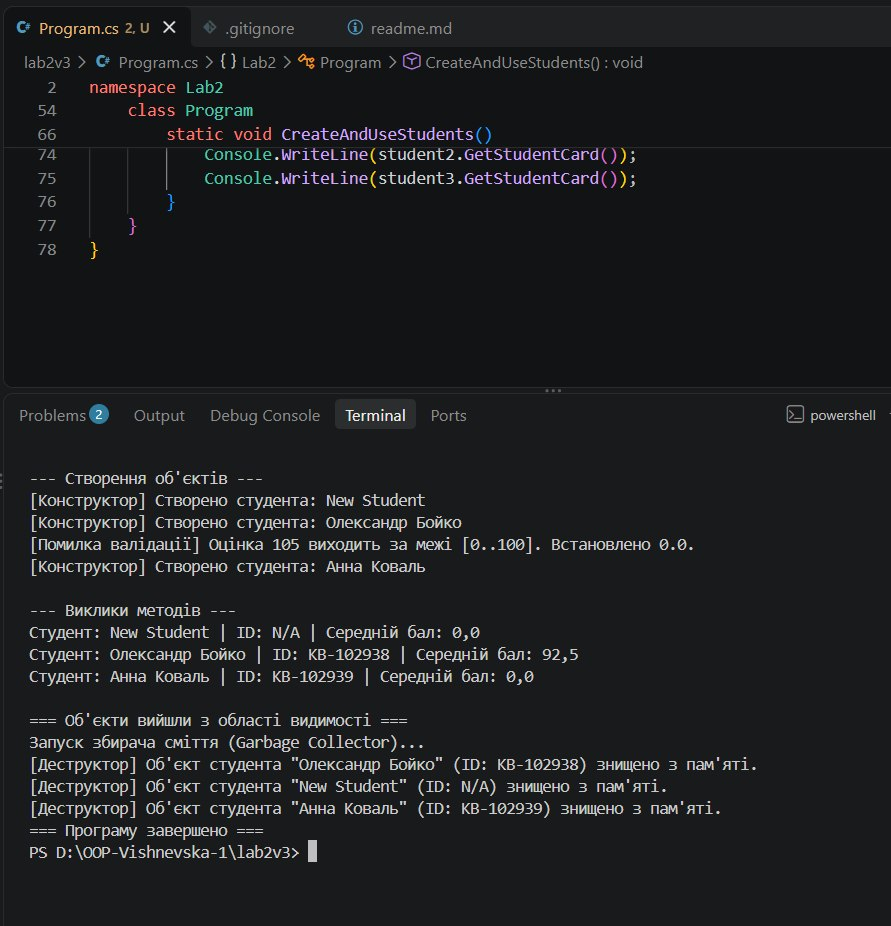

# Лабораторна робота №2 з OOP
**Тема:** Клас із кількома конструкторами. Життєвий цикл об’єкта.  
**Виконила:** Вишневська Наталія  
**Група:** ІПЗ-3/1  
**Варіант:** 3  

## 1. Посилання на GitHub-репозиторій
https://github.com/vishnevska/OOP-Vishnevska.git

## 2. Код програми (`Program.cs`)
```csharp
using System;
namespace Lab2
{
    public class Student
    {
        private string _name = string.Empty;
        private string _studentId = string.Empty;
        private double _averageMark;
        public string Name
        {
            get => _name;
            set => _name = string.IsNullOrWhiteSpace(value) ? "New Student" : value;
        }
        public string StudentId
        {
            get => _studentId;
            set => _studentId = string.IsNullOrWhiteSpace(value) ? "N/A" : value;
        }
        public double AverageMark
        {
            get => _averageMark;
            set
            {
                if (value < 0.0 || value > 100.0)
                {
                    Console.WriteLine($"[Помилка валідації] Оцінка {value} виходить за межі [0..100]. Встановлено 0.0.");
                    _averageMark = 0.0;
                }
                else
                {
                    _averageMark = value;
                }
            }
        }
        public Student(string name, string studentId, double averageMark)
        {
            Name = name;
            StudentId = studentId;
            AverageMark = averageMark;
            Console.WriteLine($"[Конструктор] Створено студента: {Name}");
        }
        public Student() : this("New Student", "N/A", 0.0)
        {
        }
        public string GetStudentCard()
        {
            return $"Студент: {Name} | ID: {StudentId} | Середній бал: {AverageMark:F1}";
        }
        ~Student()
        {
            Console.WriteLine($"[Деструктор] Об'єкт студента \"{_name}\" (ID: {_studentId}) знищено з пам'яті.");
        }
    }
    class Program
    {
        static void Main(string[] args)
        {
            Console.WriteLine("=== Початок виконання роботи ===");
            CreateAndUseStudents();
            Console.WriteLine("\n=== Об'єкти вийшли з області видимості ===");
            Console.WriteLine("Запуск збирача сміття (Garbage Collector)...");
            GC.Collect();
            GC.WaitForPendingFinalizers();
            Console.WriteLine("=== Програму завершено ===");
        }
        static void CreateAndUseStudents()
        {
            Console.WriteLine("\n--- Створення об'єктів ---");
            Student student1 = new Student();
            Student student2 = new Student("Олександр Бойко", "KB-102938", 92.5);
            Student student3 = new Student("Анна Коваль", "KB-102939", 105.0);
            Console.WriteLine("\n--- Виклики методів ---");
            Console.WriteLine(student1.GetStudentCard());
            Console.WriteLine(student2.GetStudentCard());
            Console.WriteLine(student3.GetStudentCard());
        }
    }
}
```


## 3. Результат виконання програми



## 4. Висновок

Під час виконання лабораторної роботи було опановано механізм перевантаження
 конструкторів у C# та досліджено життєвий цикл об’єктів. За допомогою конструкції
  `: this(...)` реалізовано ланцюговий виклик конструкторів, що дозволило уникнути 
  дублювання коду ініціалізації.
У властивостях класу `Student` реалізовано валідацію вхідних даних (перевірку середнього
 балу в межах від 0 до 100).
Після того як об'єкти вийшли з області видимості в окремому методі `CreateAndUseStudents()`,
 вони втратили активні посилання та стали доступними для видалення. За допомогою 
примусового виклику збирача сміття (`GC.Collect()` та `GC.WaitForPendingFinalizers()`) 
було наочно продемонстровано роботу деструкторів `~Student()`, які автоматично 
спрацьовують при вивільненні пам'яті Garbage Collector'ом.
