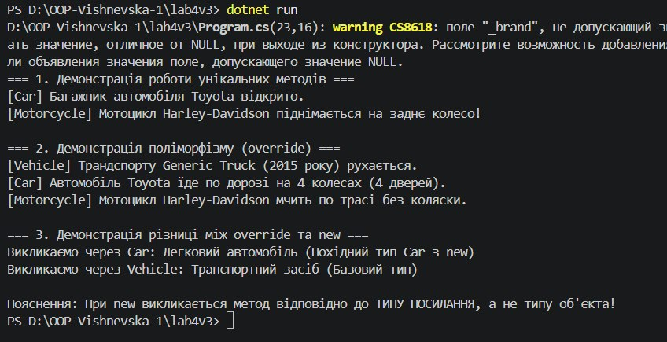

# Лабораторна робота №4 з OOP

**Тема:** Наслідування. Ключові слова base, override, virtual. Приховування членів (new).  
**Виконила:** Вишневська Наталія
**Група:** ІПЗ-3/1  
**Варіант:** 3  

---

## 1. Посилання на GitHub-репозиторій
https://github.com/vishnevska/OOP-Vishnevska.git

---

## 2. Короткий опис ієрархії класів
Реалізовано ієрархію класів транспортних засобів:
* **`Vehicle` (базовий клас)**: поля `Brand`, `Year`. Містить віртуальний метод `virtual 
 void Drive()` та метод `string GetVehicleType()`.
* **`Car` (похідний клас)**: додано властивість `NumDoors`, викликає `base(brand, year)`.
 Перевизначає `Drive()` через `override`, містить унікальний метод `OpenTrunk()` та 
 приховує метод `GetVehicleType()` за допомогою модифікатора `new`.
* **`Motorcycle` (похідний клас)**: додано властивість `HasSidecar`, викликає `base(brand, year)
`. Перевизначає `Drive()` через `override` та містить унікальний метод `Wheelie()`.

---

## 3. Результат виконання програми

## 4. Відповіді на контрольні запитання

1. **Принцип наслідування в ООП:**  
   Це механізм, який дозволяє створити новий (похідний) клас на основі існуючого (базового)
    класу, успадковуючи його властивості та методи. *Приклад:* Базовий клас `Vehicle`
     описує загальні риси транспорту, а `Car` розширює його специфічними якостями.

2. **Для чого використовується ключове слово `base`:**  
   Використовується для звернення до елементів базового класу з похідного. Наприклад,
    `base(brand, year)` викликає конструктор базового класу для ініціалізації спільних
     полів.

3. **Різниця між `virtual` та `override`:**  
   `virtual` вказує у базовому класі, що метод *можна* перевизначити. `override` вказує 
   у похідному класі, що надається *нова реалізація* цього віртуального методу. Разом вони 
   забезпечують динамічний поліморфізм (метод обирається за фактичним типом об'єкта під час 
   виконання).

4. **Коли використовувати `new` для приховування та наслідки:**  
   Модифікатор `new` використовується, коли в похідному класі треба створити метод з таким
    же ім'ям, як у базовому, але без віртуального зв'язку (коли ми свідомо НЕ хочемо 
    перевизначати логіку базового класу).  
   *Наслідок:* Виклик методу з `new` залежить від типу посилання (змінної), а не від 
   фактичного об'єкта в пам'яті.